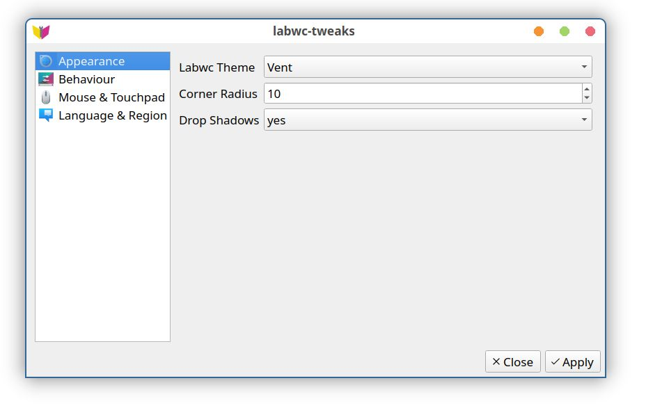

# labwc-tweaks

[![CI]](https://github.com/labwc/labwc-tweaks/actions/workflows/build.yml)

This is a GUI 'Settings' application for labwc.



### dependencies

Runtime:

- Qt6 base
- libxml2
- glib2

Build:

- CMake
- Qt Linguist Tools
- Git (optional, to pull latest VCS checkouts)

### build

`CMAKE_BUILD_TYPE` is usually set to `Release`, though `None` might be a valid [alternative].<br>
`CMAKE_INSTALL_PREFIX` has to be set to `/usr` on most operating systems.

```bash
cmake -B build -D CMAKE_BUILD_TYPE=Release -D CMAKE_INSTALL_PREFIX=/usr -W no-dev
cmake --build build --verbose
```

### test

```bash
ctest --verbose --force-new-ctest-process --test-dir build
```

### install

Using `sudo make install` is discouraged, instead use the system package manager where possible.

In this packaging simulation, CMake installs the binary to /usr/bin
and data files to their respective locations in a "package" directory.

```bash
DESTDIR="$(pwd)/package" cmake --install build
```

If you find it a useful tool and want to expand its scope, feel free.

### packages

[![Packaging status]](https://repology.org/project/labwc-tweaks/versions)

### translations

For contributing translations the [LXQt Weblate] platform can be used.

[![Translation status]](https://translate.lxqt-project.org/widgets/labwc/)

### licenses

- labwc-tweaks is licensed under the [GPL-2.0-only] license
- LXQt build tools cmake modules are licensed under the [BSD-3-Clause] license.


[alternative]:          https://wiki.archlinux.org/title/CMake_package_guidelines#Fixing_the_automatic_optimization_flag_override
[BSD-3-Clause]:         BSD-3-Clause
[CI]:                   https://github.com/labwc/labwc-tweaks/actions/workflows/build.yml/badge.svg
[GPL-2.0-only]:         LICENSE
[LXQt Weblate]:         https://translate.lxqt-project.org/projects/labwc/labwc-tweaks/
[Packaging status]:     https://repology.org/badge/vertical-allrepos/labwc-tweaks.svg
[Translation status]:   https://translate.lxqt-project.org/widgets/labwc/-/labwc-tweaks/multi-auto.svg
