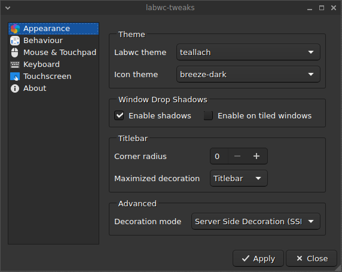

## ℹ️ Overview

`labwc-tweaks` is a GUI settings application for `labwc`.

It manages settings in `rc.xml` and `environment`.

Obligatory screenshot:



## 🚀 Usage instructions

### Usage

Use environment variable `LABWC_CONFIG_DIR` to specify a non-standard location
for configuration files.

### Custom acceleration

The Custom acceleration profile requires a Labwc version with
[custom acceleration support](https://github.com/labwc/labwc/pull/3715).
It disables Pointer Speed; Scroll Factor still applies.

Each Motion, Scroll, or Fallback curve is optional. Enable its **Define** checkbox
to configure a positive, finite Step and 2–32 finite, non-negative Points.
Points are output speeds at equally spaced input-speed samples. Invalid input
prevents Apply while Custom is selected.

Undefined Motion and Scroll curves use Fallback. If Fallback is also undefined,
unspecified movement types have no acceleration. Selecting Custom alone does not
create any curves. Unchecking **Define** removes that curve when applied.
Existing attributes and child elements are read; edited curves use child elements.
Untouched curves retain their values and XML structure.

## ⬇️ Build instructions

### Dependencies

Runtime:

- Qt6 base
- libxml2
- glib2

Build:

- CMake
- Qt Linguist Tools
- Git (optional, to pull latest VCS checkouts)

### Build

`CMAKE_BUILD_TYPE` is usually set to `Release`, though `None` might be a valid [alternative].<br>
`CMAKE_INSTALL_PREFIX` has to be set to `/usr` on most operating systems.

```bash
cmake -B build -D CMAKE_BUILD_TYPE=Release -D CMAKE_INSTALL_PREFIX=/usr -W no-dev
cmake --build build --verbose
```

### Test

```bash
ctest --verbose --force-new-ctest-process --test-dir build
```

### Install

Using `sudo make install` is discouraged, instead use the system package manager where possible.

In this packaging simulation, CMake installs the binary to /usr/bin
and data files to their respective locations in a "package" directory.

```bash
DESTDIR="$(pwd)/package" cmake --install build
```

If you find it a useful tool and want to expand its scope, feel free.

## Packages

[![Packaging status]](https://repology.org/project/labwc-tweaks/versions)

## Translations

For contributing translations the [LXQt Weblate] platform can be used.

[![Translation status]](https://translate.lxqt-project.org/widgets/labwc/)

## Licenses

- labwc-tweaks is licensed under the [GPL-2.0-only] license
- LXQt build tools cmake modules are licensed under the [BSD-3-Clause] license.


[alternative]:          https://wiki.archlinux.org/title/CMake_package_guidelines#Fixing_the_automatic_optimization_flag_override
[BSD-3-Clause]:         BSD-3-Clause
[CI]:                   https://github.com/labwc/labwc-tweaks/actions/workflows/build.yml/badge.svg
[GPL-2.0-only]:         LICENSE
[LXQt Weblate]:         https://translate.lxqt-project.org/projects/labwc/labwc-tweaks/
[Packaging status]:     https://repology.org/badge/vertical-allrepos/labwc-tweaks.svg
[Translation status]:   https://translate.lxqt-project.org/widgets/labwc/-/labwc-tweaks/multi-auto.svg
